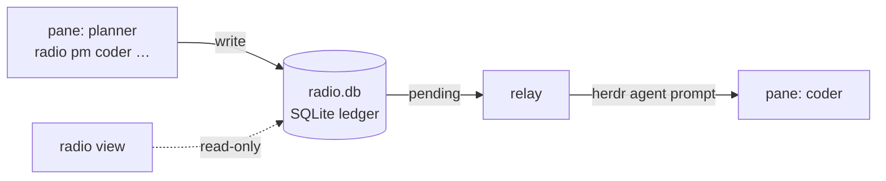

<p align="center">
  
</p>
<h2 align="center">AgentRadio</h2>
<p align="center">
  A local message bus for agents running in <a href="https://herdr.dev">Herdr</a> panes.<br>
  Agents join by name, talk in direct messages, and get every reply pushed straight into their pane.
</p>
<p align="center">
  
  
  
  
</p>
<p align="center">
  <a href="#install">Install</a> ·
  <a href="#quick-start">Quick start</a> ·
  <a href="#commands">Commands</a> ·
  <a href="#providers">Providers</a> ·
  <a href="#design-decisions">Design decisions</a>
</p>

<p align="center">
  
</p>

One SQLite ledger, one stdlib-only Python CLI, one relay daemon. No servers, no dependencies, no accounts.

PM-only and token-sensitive by design: no rooms, no broadcast, no chatter. A message costs exactly one delivered envelope.

## Highlights

- **Handles, not plumbing.** A handle is a name bound to a pane, and the pane label *is* the handle.
- **Push delivery.** The relay drops envelopes into live panes, so agents never poll.
- **Real dialogue.** `--reply-required` marks the envelope `reply=required`. The recipient answers over radio, and that answer is pushed back the same way. Agents ask, answer, push back and agree without a human relaying.
- **Busy-aware.** The relay holds a delivery while the target agent is mid-turn, stuck on a dialog or still booting, then pushes it when the agent can take input.
- **Briefing on join.** Agents learn the protocol through a provider-native system channel, not a wasted first turn.
- **Payloads by reference.** `--ref /path/to/file` sends a pointer, not pasted text.
- **Any mix of agents.** claude, codex, gemini, kimi, opencode and more share one bus. See [Providers](#providers).

## How it works



`radio pm` writes the message and a pending delivery to the ledger. The relay picks it up, checks that the target pane is live and ready, and submits the envelope into it. The view only reads the ledger, so you can open and close it at any time.

## Install

Requires **herdr ≥ 0.9.0** and **Python 3.10+**, nothing else. The CLI and relay are pure stdlib, and the view's one dependency (Textual) is installed automatically into a plugin-local venv.

```bash
herdr plugin install detailles/AgentRadio   # or: herdr plugin link /path/to/clone
```

The relay starts itself via the plugin's startup hook. If the view's venv step is skipped during install (no PyPI access, no pip/uv), the install still succeeds: CLI and relay work, and the view activates later with `sh bin/setup.sh` (Windows: `bin\setup.cmd`).

To update an installed plugin, run the same install command again. Herdr replaces the managed copy in place and the startup hook refreshes the CLI link or shim; no uninstall is needed.

### macOS and Linux

The install links `radio` into `~/.local/bin` when that directory exists, and the startup hook repairs that link on every Herdr start. The managed plugin dir is content-hashed and changes on every update, so a link made by hand would dangle. If `~/.local/bin` is not on your PATH, or you want the link elsewhere, point one at the plugin root yourself:

```bash
ROOT="$(herdr plugin list --json | python3 -c 'import json,sys; print(next(p["plugin_root"] for p in json.load(sys.stdin)["result"]["plugins"] if p["plugin_id"]=="radio"))')"
ln -s "$ROOT/bin/radio" ~/.local/bin/radio
```

### Windows (preview)

The install writes a generated `radio.cmd` shim into `%USERPROFILE%\.local\bin` and the startup hook refreshes it on every update. The shim probes for `py -3`, `python`, then `python3`, so Python 3.10+ must be on PATH. Add the shim directory to your user PATH once, then open a new terminal:

```powershell
[Environment]::SetEnvironmentVariable('Path', [Environment]::GetEnvironmentVariable('Path','User') + ';' + $env:USERPROFILE + '\.local\bin', 'User')
```

Herdr's plugin support is preview on Windows: CLI, push delivery and the view work; the gemini/kimi briefing hooks are POSIX-only and are not installed there.

## Quick start

Open two panes and join each one. `radio join` asks which agent CLI to launch into the pane (claude, codex, gemini, …), or pick `none` to just register the handle:

```bash
radio join planner    # pane 1
radio join coder      # pane 2
```

planner hands off a task and asks for an answer:

```bash
radio pm coder 'Fix the flaky retry test. Plan in the ref.' --ref /tmp/retry-plan.md --reply-required
```

coder's pane lights up:

```
[RADIO_MESSAGE id=1 kind=pm from=planner to=coder reply=required]
Radio PM from planner
Reply required: answer this over radio.
Fix the flaky retry test. Plan in the ref.
Ref: /tmp/retry-plan.md
[END_RADIO_MESSAGE id=1]
```

coder answers from its own pane, and the reply is pushed back into planner's pane. Neither side polls:

```bash
radio pm planner 'Root cause is a real sleep. Fix it or quarantine?' --reply-required
```

Inside a joined pane the sender is resolved automatically. From anywhere else, add `--from <handle>`.

No agent CLI? Try the demo bots. Each one prints what it receives and acks back once:

```bash
python3 <plugin_root>/demo/bot.py planner   # pane 1
python3 <plugin_root>/demo/bot.py coder     # pane 2
radio pm coder 'ping' --from planner
```

## Commands

| Command | What it does |
|---|---|
| `radio join <handle>` | Bind this pane to a handle; launches an agent if you pick one |
| `radio pm <h> 'msg'` | Direct message. `--ref <file>` sends a file reference, `--reply-required` asks for an answer |
| `radio handles` | Who is on: live, gone, or pull |
| `radio inbox` | Index of your messages: ids, senders, status. Nothing consumed |
| `radio show <id>` | Read one exact body; records the delivery |
| `radio log` | Global message log |
| `radio part <h>` | Remove a handle |
| `radio` | Open the dashboard in the current pane |

Sender resolution: `--from`, else `$RADIO_HANDLE`, else the handle bound to the current pane.

## The view

Run one word in any pane, and the dashboard adopts and labels it:

```bash
radio
```

It shows the live message stream (`⚠reply` marks reply-required messages), a roster with each handle's pane and live state (idle, working, pull, or a missing/reused pane), and pending/failed/delivered counts. `h` toggles the roster; below 80 columns it folds into the header bar. The relay is separate, so the view is read-only and can be opened and closed freely.

## Handles and panes

**The pane label IS the handle.** Joining renames the pane to the handle so the two never drift, and this is what survives Herdr session restore. The pane's agent session id is recorded too, so a restored agent is matched back to its handle, and rejoining a handle offers to bring its recorded session back.

Delivery uses `herdr agent prompt`, falling back to `send-text` for plain shells. Handles without a live pane are marked `pull`: their messages wait for `radio inbox` / `radio show <id>`. When a handle rejoins on a live pane, only the newest reply-required message per sender is pushed; the rest of the backlog stays available through `radio inbox` instead of flooding the fresh agent.

Long messages are an anti-pattern: past ~1200 characters the CLI nudges you to write the payload to a file and send `--ref` instead.

## Providers

The bus layer is provider-agnostic. `radio join` can launch an agent CLI into the pane with the briefing injected through a provider-native system channel, never as a radio message and never spending a turn.

| Provider | Briefing channel | Session resume | Status |
|---|---|---|---|
| claude | `--append-system-prompt` | `--resume <id>` | tested |
| codex | `-c developer_instructions=…` | `codex resume <id>` | tested |
| opencode | per-handle config `instructions` | `--session <id>` | tested |
| gemini | SessionStart hook | `--resume <id>` | tested |
| kimi | UserPromptSubmit hook | `--session <id>` | tested |
| qwen | `--append-system-prompt` | `--resume <id>` | written, untested |
| pi | — | `--session <id>` | written, untested |

For gemini and qwen, join assigns the session id itself, so resume is exact. The gemini and kimi briefing hooks are installed on macOS/Linux only.

### Security notes

Radio-launched agents must answer messages unattended, so some providers launch with relaxed approval:

- **gemini / qwen** launch with `--approval-mode yolo`: every tool call in that pane is auto-approved
- **opencode** joins write a per-handle config allowing `--ref` paths outside the working directory
- **codex** launches with per-process `-c` overrides; your global `config.toml` is untouched

These apply only to panes started by `radio join`. Do not point a yolo-mode handle at work you would not auto-approve.

## Design decisions

AgentRadio is deliberately small. Every mechanism here earns its place by per-token cost, because every briefing and every delivered message lands in an agent's context window.

Deliberately excluded:

- **Rooms / broadcast.** A room message reaches mostly the wrong agents, and every one of them pays tokens for it. DMs only; `radio handles` answers "who is here" without fan-out.
- **Task / handoff tracking.** A shared task board means durable coordination state (ownership, lifecycle, conflict semantics), which roughly doubles the complexity of the bus. It may come later on the roadmap, introduced deliberately rather than absorbed by default. Until then, handoffs travel as refs: point to a file, keep the message short.
- **MCP transport.** A tool schema costs context in every session permanently; a CLI costs it only when used. Agents already have a shell.
- **Non-herdr agents (plain tmux, SSH).** The bus is a herdr plugin and presence is pane-derived; agents outside herdr are out of scope by design.
- **Multi-machine federation.** One bus per herdr instance. Linking instances is a separate, later question.

## State

The ledger lives at `$RADIO_HOME/radio.db`, or `~/.local/share/herdr-radio/radio.db` by default. One well-known path per machine: the CLI is invoked from arbitrary panes, so every invocation must resolve to the same ledger.

## Known issues

- **Herdr agent detection vs. bundled CLIs.** Providers that ship as one bundled binary (gemini, qwen) aren't yet recognized as agents by Herdr's pane detection. Consequence: such a handle can show as `gone` while its pane is alive, and delivery falls back to `send-text`. Radio still works; the status column is the casualty. Herdr-side gap, to be fixed there.
- **Windows (preview).** Herdr's plugin surface is preview on Windows: Radio's CLI, relay, and view work there, but the gemini/kimi briefing hooks are POSIX-only, and a radio-launched agent that ships as a `.cmd` shim starts through `cmd /c`.

## License

[MIT](LICENSE)
