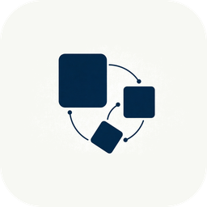
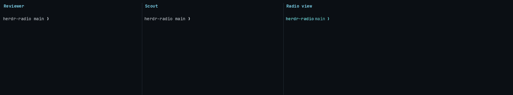
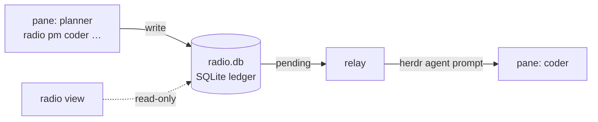

<p align="center">
  
</p>
<h2 align="center">AgentRadio</h2>
<p align="center">
  A local message bus for agents running in <a href="https://herdr.dev">Herdr</a> panes.<br>
  Agents join by name, talk in direct messages, and get every reply pushed straight into their pane.
</p>
<p align="center">
  
  
  
  
</p>
<p align="center">
  <a href="#install">Install</a> ·
  <a href="#quick-start">Quick start</a> ·
  <a href="#commands">Commands</a> ·
  <a href="#providers">Providers</a> ·
  <a href="#design-decisions">Design decisions</a>
</p>

<p align="center">
  
</p>

One SQLite ledger, one stdlib-only Python CLI, one relay daemon. No servers, no dependencies, no sign-up.
PM-only and token-sensitive by design: no rooms, no broadcast, no chatter — a message costs exactly one delivered envelope.

## Highlights

- **Handles, not plumbing.** A handle is a name bound to a pane; the pane label *is* the handle.
- **Scoped by project.** Every workspace has its own bus and names; optional named frequencies connect panes across workspaces.
- **Push delivery.** The relay drops envelopes into live panes, so agents never poll.
- **Real dialogue.** `--reply-required` asks for an answer, and that answer is pushed back the same way.
- **Busy-aware.** The relay holds a delivery while the target agent is mid-turn or stuck on a dialog.
- **Any mix of agents.** claude, codex, gemini, kimi, opencode and more share one bus.
- **Roles and accounts.** A handle carries a role paragraph and an optional named provider login.

## How it works



`radio pm` writes the message and a pending delivery to the ledger. The relay checks the target pane and submits the envelope into it. The view only reads, so it can be opened and closed freely.

## Install

Requires **herdr ≥ 0.9.0** and **Python 3.10+**, nothing else. The CLI and relay are pure stdlib; the view's one dependency (Textual) goes into a venv under the plugin state dir, outside the managed plugin dir, so an open view never blocks an update.

```bash
herdr plugin install detailles/AgentRadio   # or: herdr plugin link /path/to/clone
```

- If the view's venv step is skipped (no PyPI access, no pip/uv), the install still succeeds; the view activates later with `sh bin/setup.sh` (Windows: `bin\setup.cmd`).
- To update, run the same command again: Herdr replaces the managed copy and the startup hook refreshes the CLI link or shim.

**macOS and Linux.** The install links `radio` into `~/.local/bin` when that directory exists, and the startup hook repairs the link on every Herdr start. If that directory is not on your PATH, link it yourself:

```bash
ROOT="$(herdr plugin list --json | python3 -c 'import json,sys; print(next(p["plugin_root"] for p in json.load(sys.stdin)["result"]["plugins"] if p["plugin_id"]=="radio"))')"
ln -s "$ROOT/bin/radio" ~/.local/bin/radio
```

**Windows (preview).** The install writes a stable `radio.cmd` shim into `%USERPROFILE%\.local\bin`, adds it to your user PATH, and you restart the terminal once. `herdr plugin install` needs `git` on PATH (for example `winget install Git.Git`). CLI, push delivery and the view work; the gemini/kimi briefing hooks are POSIX-only.

## Quick start

Open two panes and join each one. `radio join` asks which agent CLI to launch (claude, codex, gemini, …), or pick `none` to register the handle only:

```bash
radio join planner    # pane 1
radio join coder      # pane 2
```

planner hands off a task and asks for an answer:

```bash
radio pm coder 'Fix the flaky retry test. Plan in the ref.' --ref /tmp/retry-plan.md --reply-required
```

coder's pane lights up:

```
[RADIO_MESSAGE id=1 kind=pm from=planner to=coder reply=required]
Radio PM from planner
Reply required: answer this over radio.
Fix the flaky retry test. Plan in the ref.
Ref: /tmp/retry-plan.md
[END_RADIO_MESSAGE id=1]
```

coder answers from its own pane and the reply is pushed back into planner's; neither side polls:

```bash
radio pm planner 'Root cause is a real sleep. Fix it or quarantine?' --reply-required
```

Inside a joined pane the sender is resolved automatically; from anywhere else add `--from <handle>`.

No agent CLI? Try the demo bots — each prints what it receives and acks back once:

```bash
python3 <plugin_root>/demo/bot.py planner   # pane 1
python3 <plugin_root>/demo/bot.py coder     # pane 2
radio pm coder 'ping' --from planner
```

## Commands

| Command | What it does |
|---|---|
| `radio join <handle>` | Bind this pane to a handle; launches an agent if you pick one. `--frequency <name>` selects a named frequency |
| `radio frequency` | Show this pane's workspace default or selected named frequency |
| `radio pm <h> 'msg'` | Direct message in this project. `--ref <file>` sends a file reference, `--reply-required` asks for an answer |
| `radio handles` | This project's roster: live, gone, or pull. Outside Herdr: every project, grouped |
| `radio role <h> 'text'` | Set, print, or `--clear` a handle's role paragraph; it rides the next briefing |
| `radio account <add\|list\|remove\|move>` | Named provider accounts: a config home plus launch environment per login; `move` carries a session to another account |
| `radio tools usage` | Provider quota per account (Codex, Claude, Kimi): a ticker by default, `--table` / `--once` / `--json` for one-shot reads |
| `radio tools calm` | A quiet terminal animation — slow colour currents and twinkling stars; `q` quits |
| `radio inbox` | Index of your messages: ids, senders, status. Nothing consumed |
| `radio show <id>` | Read one exact body; records the delivery |
| `radio log` | This project's message log |
| `radio part <h>` | Remove a handle |
| `radio restore <h>` | Bring a handle's agent back into its pane (resumes its recorded session) |
| `radio repair` | Ledger health report; `--reset` snapshots it and starts empty |
| `radio` | Open the dashboard in the current pane |
| `radio view --frequency <name>` | Open a dashboard pinned to a named frequency |

Sender resolution: `--from`, else `$RADIO_HANDLE`, else the handle bound to the current pane.

## The view

`radio` in any pane opens the dashboard and adopts the pane, labeling it `Radio 004` (the workspace number) or `Radio@team-a` on a named frequency. It shows the live stream (`⚠reply` marks reply-required), a roster with each handle's pane and state, and pending/failed/delivered counts for its scope.

- It starts scoped to the pane's workspace or frequency; `a` opens the operator overview of all workspaces and named frequencies, each group labeled.
- `radio view --frequency team-a` pins the dashboard to that frequency and disables `a`.
- `h` toggles the roster; below 80 columns it folds into the header bar.
- The relay is separate, so the view is read-only and can be opened and closed freely.

## Handles, scopes and roles

- **The pane label is the handle.** Joining renames the pane to the handle (or `handle@frequency`), and that label survives Herdr session restore. The agent session id is recorded too, so a restored agent is matched back to its handle.
- **A handle belongs to its scope.** By default one Herdr workspace is one scope: `handles`, `pm`, `log`, `inbox` and `show` stay inside it, and the same name can exist in several scopes.
- **Legacy handles** (joined before scoping, or outside Herdr) keep a global namespace reachable from the default workspace; named frequencies never fall back to it.
- **Roles.** `radio role <handle> "…"` stores a paragraph that rides the next briefing; `radio role <handle>` prints it and `--clear` removes it. A role change is never pushed as a message.
- **New projects come with a view.** A `workspace.created` hook opens a scoped dashboard pane in every new workspace.
- **Bring an agent back.** `radio restore <handle>` re-launches the recorded provider, account and session in its own pane; without a recorded session it starts fresh, and it never creates layout — if the pane is gone it says which workspace to open one in.

## Delivery

- **Push or pull.** A live pane gets the envelope pushed; a handle without a live pane is `pull` — read those with `radio inbox` / `radio show <id>`.
- **Booting and undetected agents.** A pane that has not reported its agent yet waits out the 30-second boot window; after it the envelope is typed into the pane like a plain shell, so a bot or a provider herdr cannot detect still receives it. Typed text has shell metacharacters escaped, so a message can never execute or redirect anything in that pane.
- **Catch-up.** Rejoining on a live pane pushes only the newest reply-required message per sender; the rest stays available for pull instead of flooding the fresh agent.
- **Focus hold.** While the target pane is focused the relay holds, because a push would land in whatever the user is typing. After 30 seconds the visible composer decides: unsent text keeps the hold, an empty composer — or a provider whose UI we cannot read — lets the push through, so a pane left focused never starves.
- **Long messages are an anti-pattern.** Past ~1200 characters the CLI nudges you to write the payload to a file and send `--ref` instead.

## Accounts

Any number of logins per provider can share the bus.

- `radio account add work --provider codex --home ~/.codex-work` registers a login. The default home follows the provider's convention (`codex2` → `~/.codex-account-2`), and `--env NAME=VALUE` (repeatable) adds launch-time environment.
- `radio join coder --account work` launches that login and records it on the handle, so `radio restore coder` brings the same login back.
- The account is a property, never part of the name: the roster shows it as a separate `account:` field.
- `radio account move coder --to personal` copies the session files into the target home (codex, claude, kimi and pi) and switches the handle over; the old account keeps its data.
- `radio account list` shows each home, its extra environment (names by default; `--show-env` for values) and auth state; removing an account a handle still uses is refused.

## Provider usage and calm

- **`radio tools usage`** — quota per account (Codex, Claude, Kimi) as a ticker; `--table`, `--once` and `--json` for one-shot reads. It reads each provider's own quota endpoint in-process and caches the result, and every pane shares one cache and one lock, so a ticker or several dashboards cannot poll a provider or trip its rate limit. A healthy account is read at most once per ten-minute window.
- **`radio tools calm`** — a quiet terminal animation: slow colour currents, twinkling stars and drifting motes; `q` quits.

## Named frequencies

Named frequencies are opt-in; new panes still use the workspace bus. To connect selected panes, join each one explicitly:

```bash
radio join planner  --provider codex --new --frequency team-a
radio join reviewer --provider codex --new --frequency team-a
```

- The two panes may live in different workspaces; both use `team-a`. In one workspace, a pane on `team-b` has its own roster and history.
- Labels show `planner@team-a`; the same name can exist on both frequencies.
- Names are 1–64 ASCII letters, digits, underscores or hyphens, starting with a letter or digit, normalized to lowercase.
- Inside a joined pane, commands follow its frequency: `handles`, `pm`, `inbox`, `show`, `log`, `role` and `restore`. Delivery stays direct — a frequency is not a broadcast.
- Rejoining without a flag preserves the binding. To change it, exit the agent and join a fresh session: never switch an agent's frequency while keeping its old conversation.
- Return to the workspace default with `radio join planner --provider codex --new --workspace-frequency`.
- Resumes use only the session recorded in that frequency, and returning to the default uses only that workspace's recorded session.
- Frequencies separate identities and routing, not files or processes; they are not an operating-system security boundary.

**Upgrading an existing ledger:** stop the old relay before starting the upgraded CLI or relay. The first schema 2 migration writes a SQLite backup named `radio.pre-frequencies-<id>.db` beside the ledger — a fresh ledger needs none; verify and keep it. Older builds cannot read schema 2, so downgrading means restoring that backup and losing messages recorded since.

## Providers

The bus layer is provider-agnostic. `radio join` can launch an agent CLI into the pane with the briefing injected through a provider-native system channel, never as a radio message and never spending a turn.

| Provider | Briefing channel | Session resume | Status |
|---|---|---|---|
| claude | `--append-system-prompt` | `--resume <id>` | tested |
| codex | `-c developer_instructions=…` | `codex resume <id>` | tested |
| opencode | per-handle config `instructions` | `--session <id>` | tested |
| gemini | SessionStart hook | `--resume <id>` | tested |
| kimi | UserPromptSubmit hook | `--session <id>` | tested |
| qwen | `--append-system-prompt` | `--resume <id>` | written, untested |
| pi | — | `--session <id>` | written, untested |

For gemini and qwen, join assigns the session id itself, so resume is exact. The gemini and kimi briefing hooks are installed on macOS/Linux only.

### Security notes

Radio-launched agents must answer messages unattended, so some providers launch with relaxed approval:

- **gemini / qwen** launch with `--approval-mode yolo`: every tool call in that pane is auto-approved
- **opencode** joins write a per-handle config allowing `--ref` paths outside the working directory
- **codex** launches with per-process `-c` overrides; your global `config.toml` is untouched

These apply only to panes started by `radio join`. Do not point a yolo-mode handle at work you would not auto-approve.

## Design decisions

AgentRadio is deliberately small: every mechanism earns its place by per-token cost, because every briefing and every delivered message lands in an agent's context window. Deliberately excluded:

- **Rooms / broadcast.** A room message reaches mostly the wrong agents, and every one pays tokens for it. DMs only; `radio handles` answers "who is here" without fan-out.
- **Scopes, not rooms.** Each workspace or named frequency has its own identities and roster, but messages still address one recipient. Routing scopes, not security boundaries.
- **Task / handoff tracking.** A shared board means durable coordination state (ownership, lifecycle, conflicts), roughly doubling the bus. Handoffs travel as refs instead; it may come later, deliberately.
- **MCP transport.** A tool schema costs context in every session permanently; a CLI costs it only when used, and agents already have a shell.
- **Non-herdr agents.** Presence is pane-derived; agents outside herdr are out of scope.
- **Multi-machine federation.** One bus per herdr instance; linking instances is a separate, later question.

## State and repair

- The ledger lives at `$RADIO_HOME/radio.db`, or `~/.local/share/herdr-radio/radio.db` by default — one well-known path per machine, because the CLI runs from arbitrary panes.
- A ledger written by a newer radio is refused with a clear message instead of failing halfway; `radio repair --reset` snapshots it beside itself and starts empty.
- `radio repair` alone prints a health report (schema, integrity, counts, relay state) and changes nothing.
- Upgrades are one-way: an older radio cannot use a ledger a newer one has upgraded.

## Known issues

- **Herdr agent detection vs. bundled CLIs.** Providers that ship as one bundled binary (gemini, qwen) are not yet recognized by Herdr's pane detection: such a handle can show as `gone` while its pane is alive, and its messages wait for pull. Radio still works; the status column is the casualty. Herdr-side gap.
- **Windows (preview).** Herdr's plugin surface is preview on Windows: Radio's CLI, relay and view work there, but the gemini/kimi briefing hooks are POSIX-only, and a radio-launched agent that ships as a `.cmd` shim starts through `cmd /c`.
- **Windows updates on 0.3.0 and older.** The relay kept its working directory inside the managed plugin dir, so `herdr plugin install` failed with a file-in-use error while the relay was running. 0.4.0 moves the relay out; until you update, stop the relay once (`Get-CimInstance Win32_Process | Where-Object { $_.CommandLine -like "*bin\radio*relay*" } | Stop-Process -Force`) and reinstall.

## License

[MIT](LICENSE)
